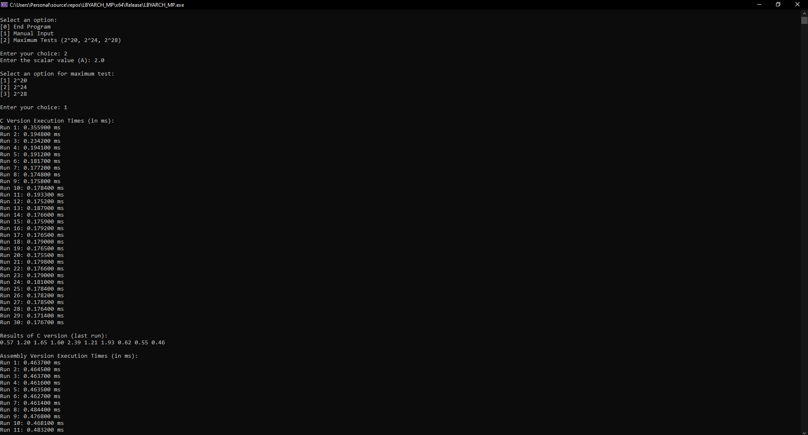
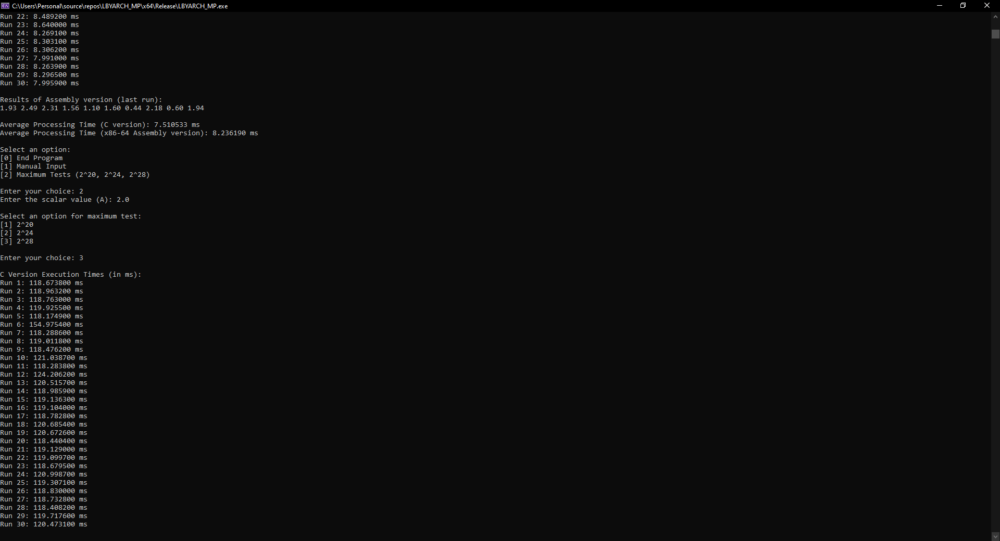

# LBYARCH Machine Project

This repository contains a implementation of the SAXPY operation (A*X + Y), a fundamental linear algebra computation used in various scientific and engineering applications. The project showcases two versions of the SAXPY kernel: one written in C Language and another in x86-64 assembly language, both designed to leverage their computational efficiency on the said SAXPY operation.

## Specifications

Write the kernel in (1) C program and (2) x86-x64 assembly language. The kernel is to perform SAXPY (A*X + Y) Function

- Input: Scalar variable n (integer) contains the length of the vector. Scalar variable A is a single-precision float. Vectors X, Y and Z are single-precision float.
  - In the analysis, the following values were done:
    - Scalar variable n would be of **2^20, 2^24,** and **2^28**
    - Scalar variable A is set to 2.00
    - Vectors X and Y are set to a random single-precision float

- Process:  Z[i] = A * X[i] + Y[i]

- Output: Store result in vector Z. Display the result of 1st ten elements of vector Z for all versions of kernel (i.e., C and x86-x64).

## Comparative Execution Time and Short Analysis of the Performance of the Kernels

#### Debug Mode Results
| Vector Size | C Execution Time (Average) (ms) | x86-64 Execution Time (Average) (ms) |
| :---------- | :------------------------------ | :----------------------------------- |
| 2^20        | 1.581363 ms                   |  0.491210 ms                       |
| 2^24        | 24.641193 ms                   |  8.364230 ms                       |
| 2^28        | 393.734213 ms                   |  136.502927 ms                       |

In Debug mode, the assembly implementation consistently outperforms the C implementation across all vector sizes. This performance advantage suggests that even without compiler optimizations, the manually optimized assembly code is able to leverage the CPU's capabilities more directly and efficiently. The increasing performance gap with larger vector sizes highlights the assembly code's scalability and potential lower overhead per operation. However, Debug mode is not representative of production performance, as it lacks optimizations that can drastically change execution times.

#### Release Mode Results
| Vector Size | C Execution Time (Average) (ms) | x86-64 Execution Time (Average) (ms) |
| :---------- | :------------------------------ | :----------------------------------- |
| 2^20        | 0.197680 ms                   |  0.491420 ms                       |
| 2^24        | 7.538767 ms                   |  8.338073 ms                       |
| 2^28        | 119.438317 ms                   |  131.017067 ms                       |

In Release mode, where compiler optimizations are enabled, the C implementation gains a significant performance boost, surpassing the assembly implementation in all cases. This demonstrates the effectiveness of modern compiler optimizations, which can include inlining functions, loop unrolling, and advanced instruction scheduling that may not be manually replicated in assembly code. The closer performance between the two implementations at larger vector sizes may indicate that both are reaching hardware-related limits, such as memory bandwidth or cache sizes, which serve as a natural ceiling to optimization gains. Overall, the Release mode results show the strength of C compiler optimizations, particularly for applications where maintenance and portability are also important considerations.

#### Overall Discussion
The difference between Debug and Release mode performance can be attributed to the compiler optimizations that are only enabled in Release mode. Such optimizations can include better instruction scheduling, inlining, and vectorization, which are not present in Debug mode as the focus there is on maintaining a build suitable for debugging.

It's also worth noting that the results might be influenced by other factors such as CPU architecture, the presence of SIMD instructions in the assembly code, the efficiency of memory accesses, and the particular optimizations the compiler is able to employ. The C compiler's optimizer seems particularly effective, which isn't uncommon—modern compilers are very sophisticated and can often outperform hand-written assembly, especially when it comes to exploiting specific processor features and performing higher-level optimizations.

Assembly may provide benefits when very specific optimizations are needed or when taking advantage of certain processor features that the compiler does not utilize. However, in many cases, especially with complex algorithms or when operating on large data sets, a well-optimized C implementation can be competitive with or even surpass assembly, thanks to the advanced optimizations that modern compilers can perform.

## (C and x86-x64) Screenshots of the Program Output with Correctness Check
### Debug Mode

### Correctness Check
The outputs of both the C and Assembly kernel versions were checked against each other in the results part shown in the screenshots. For clarity, the table below shows a summarized results of the output:
| Vector Size | C Result | x86-64 Result |
| :---------- | :------------------------------ | :----------------------------------- |
| 2^20        | 0.57 1.20 1.65 1.60 2.39 1.21 1.93 0.62 0.55 0.46 | 0.57 1.20 1.65 1.60 2.39 1.21 1.93 0.62 0.55 0.46 |
| 2^24        | 1.93 2.49 2.31 1.56 1.10 1.60 0.44 2.18 0.60 1.94 | 1.93 2.49 2.31 1.56 1.10 1.60 0.44 2.18 0.60 1.94 |
| 2^28        | 1.79 1.23 0.92 2.05 2.46 1.83 0.55 2.17 0.46 2.68 | 1.79 1.23 0.92 2.05 2.46 1.83 0.55 2.17 0.46 2.68 |

The table shows that upon running the project in debug mode and in various vector sizes, the outputs of the respective kernel versions are the same thus indicating that the results were correct.

---------------------
### Release Mode

### Correctness Check
The outputs of both the C and Assembly kernel versions were checked against each other in the results part shown in the screenshots. For clarity, the table below shows a summarized results of the output:
| Vector Size | C Result | x86-64 Result |
| :---------- | :------------------------------ | :----------------------------------- |
| 2^20        | 1.93 2.49 2.31 1.56 1.10 1.60 0.44 2.18 0.60 1.94 | 1.93 2.49 2.31 1.56 1.10 1.60 0.44 2.18 0.60 1.94 |
| 2^24        | 1.30 1.79 0.98 1.53 0.81 0.99 1.95 0.75 2.65 0.43 | 1.30 1.79 0.98 1.53 0.81 0.99 1.95 0.75 2.65 0.43 |
| 2^28        | 1.16 2.52 1.59 2.02 0.17 1.22 2.06 0.73 0.51 1.16 | 1.16 2.52 1.59 2.02 0.17 1.22 2.06 0.73 0.51 1.16 |

Similar to the results of the debug mode, the table shows that upon running the project in release mode and in various vector sizes the outputs of the respective kernel versions are also the same thus indicating that the results were correct.

## Contribution
This project was made in partial fulfillment of the requirements for the course LBYARCH by:
- Argamosa, Daniel Cedric S.
- Donato, Adriel Joseph Y.
